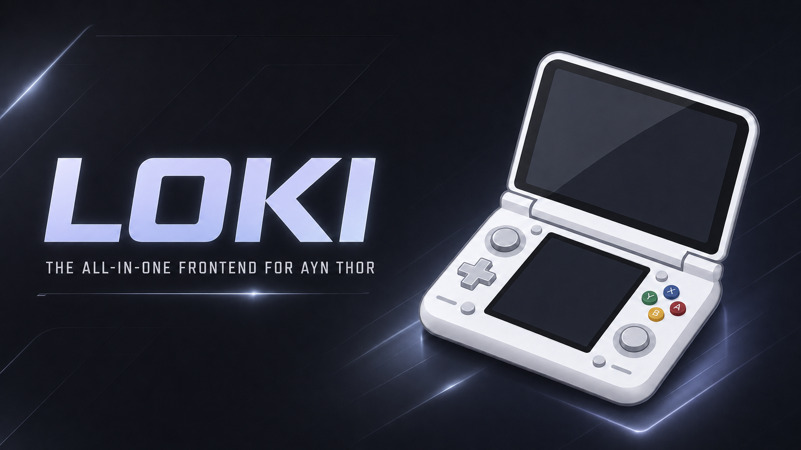

<div align="center">



# Loki for the AYN Thor

Loki is an all in one launcher built exclusively for the AYN Thor, designed to solve problems instead of creating them. Every part of the experience has been built with performance, stability, and ease of use in mind, delivering a fast, lightweight interface that takes full advantage of the Thor's unique dual screen hardware.

Unlike traditional front ends, Loki goes far beyond simply launching games. Stream movies and TV shows directly from within the launcher, connect to your PC or other devices over your local network for game streaming, and switch seamlessly into dedicated Couch Mode for a controller focused living room experience or Desktop Mode for a desktop style interface designed for larger displays. Everything is integrated into a single, cohesive experience so you never have to leave the launcher.

Loki features complete controller support across the entire interface, extensive customization options, modern dual screen layouts, built in media streaming, game streaming, and a growing collection of features designed specifically for the AYN Thor. The launcher is built to be extremely lightweight, highly optimized, and responsive, ensuring smooth performance without unnecessary overhead.

One thing worth mentioning is that Loki was never intended to recreate the look or feel of the Nintendo 3DS. If you're looking for a launcher that closely resembles the 3DS interface, Cocoon is an excellent choice. Loki instead embraces a modern design philosophy with its own identity, focusing on usability, performance, and innovation rather than copying the appearance of another system.

The goal of Loki is simple: create the most polished, feature rich, and reliable launcher available for the AYN Thor while remaining fast, intuitive, and built from the ground up for the hardware it runs on.

<br>

**[Download](../../releases)** · Android 10+ · GPL-3.0

<br>

</div>

<div align="center">

## Getting started

**1.** Download the APK from [Releases](../../releases) and install it

**2.** Open it once

**3.** Set it as your home app when Loki offers

Your games, saves and emulators are untouched. You can uninstall at any time.

<br>

### The first time you open it

A short intro plays — **once, ever**, not on every restart.

Then Loki shows you what it would like permission for. **None of it is required.**

| | Turns on |
|:--|:--|
| **Home app** | Loki opens when you press Home |
| **Accessibility** | The pointer, and typing into other apps |

Then a walkthrough takes you through everything. Replay it any time from
**Settings → About → Replay the walkthrough**.

<br>

</div>

<div align="center">

## Two screens, one launcher

One panel holds the **grid** — your icons, menus and the section bar.

The other holds **information** — artwork, details and play time for whatever the cursor is on.

<br>

Swap which is which in **Settings → System → Dual screen**.

<br>

### Play on one screen, browse on the other

Launch a game and it takes the grid's panel. The other panel stays on the launcher.

**Touch a panel to give it the controller.** Tap the game to play, tap the launcher to browse, any time.

**Home** gives a panel back to Loki, from either screen.

An entry's context menu can send it to the *other* panel instead, leaving the grid where it is.

<br>

</div>

<div align="center">

## The grid

**Every icon stays where you put it.** Empty cells stay empty. Nothing reflows.

| | |
|:--|:--|
| **Move an icon** | Hold **A**, move, press **A** to drop |
| **Change density** | Pinch — eight presets, 3×2 up to 8×5 |
| **Turn pages** | **L2** / **R2** |
| **Favourite** | **X** |
| **Context menu** | **Y** |

Placements survive rescans. Moving a ROM or reinstalling an app keeps its cell.

Icons take one of five shapes, and the cursor traces whichever shape the cell has.

<br>

### Folders

Folders hold entries, scrape their own artwork, and can be made from any entry's menu.

**Scanned games are filed into one folder per system**, so adding a console costs the grid a single cell instead of three hundred. Anything you move out stays where you put it.

<br>

</div>

<div align="center">

## Controls

| Button | Does |
|:--|:--|
| **A** | Launch — *hold* to pick up |
| **B** | Back |
| **X** | Favourite |
| **Y** | Context menu |
| **L1** / **R1** | Previous / next screenshot |
| **L2** / **R2** | Previous / next page |
| **Stick click** | Shortcut panel |
| **Start** | Start panel |
| **Select** | App drawer |
| **Guide** | Home |
| **Triggers held** | Speeds up whatever else you press |

A paired keyboard works too — WASD, E, F, Tab, Enter, Esc.

<br>

### Shortcut panel

Click either stick for the app drawer, search, settings, swap screens, rescan,
recording, Wi-Fi, Bluetooth, volume and Android settings.

<br>

### The AYN button

Its firmware doesn't send anything an app can read, so Loki can't use it.
**The stick clicks work everywhere.**

If a button seems dead, **Settings → About → Button tester** shows exactly what it sends.

<br>

</div>

<div align="center">

## The pointer

For everything a gamepad can't press — login forms, store pages, emulator settings.

**Hold Start + Select** to raise a cursor. Turn it on in **Settings → Controls → Pointer**.

| Input | Does |
|:--|:--|
| **Left stick** | Move the cursor |
| **Right stick** | Scroll |
| **A** | Click |
| **X** | Long press |
| **B** | Back |
| **Y** | Open the keyboard |
| **L1** / **R1** | Scroll a page |

To use it **outside** Loki, enable Loki's accessibility service.

<br>

### Typing into other apps

Tap a text field in any app, press **Y**, and Loki's keyboard appears on the panel
you're holding while the text lands in the field on the other screen.

Needs the accessibility permission. Apps that don't use standard Android text
fields won't accept it.

<br>

</div>

<div align="center">

## The keyboard

Loki brings its own, because Android's appears on the wrong screen on this device.

| Input | Does |
|:--|:--|
| **D-pad** | Move over the keys |
| **A** | Press |
| **B** | Delete, or close when empty |
| **X** | Space |
| **Y** | Shift |
| **L2** / **R2** | Letters ⟷ symbols |
| **Start** | Done |

Every key is a touch target too.

<br>

</div>

<div align="center">

## Your games

<br>

### 1. Add your systems

**Settings → Games & artwork → Platforms**

**47 systems** built in. **71 emulators** recognised, each handed a ROM the way
that emulator expects. Add the consoles you own and pick an emulator for each.

Standalone emulators are preferred over RetroArch and Lemuroid — a DS game goes
to melonDS or DraStic if you have one, and to a multi-core front-end only when
you don't. Among them: Azahar, Citra, Panda3DS, melonDS, DraStic, NooDS,
DuckStation, AetherSX2, Dolphin, PPSSPP, Vita3K, Flycast, Redream, Yaba Sanshiro,
Strato, Eden, Citron, Sudachi, MAME4droid, Mupen64Plus FZ, the John and `.emu`
families, Pizza Boy, My Boy!, and Winlator for Windows games. Pick a different
one per system, or per game, whenever you disagree.

<br>

### 2. Point it at your ROMs

**Settings → Games & artwork → Extra ROM folders**

Loki scans the folders you grant, matching files by extension and reading inside
`zip`, `7z`, `rar` and `chd`.

Missing files are **flagged, not deleted** — an unmounted SD card doesn't lose anything.

<br>

### 3. Let it scrape

Scanning, scraping and play-time tracking all run in the background.

Play time is recorded per game and shown on the information panel. It survives
Loki being killed mid-game, which is normal when memory is tight.

<br>

</div>

<div align="center">

## Artwork and details

Four sources, merged field by field. **Anything you edit by hand is never overwritten.**

| Source | Gives you | Needs |
|:--|:--|:--|
| **Wikidata** | Developer, publisher, dates, series | **Nothing** |
| **ScreenScraper** | Titles, credits, genres, dates, artwork | Built-in key |
| **SteamGridDB** | Square grid artwork | Your API key |
| **RAWG** | Descriptions, ratings, screenshots | Your API key |

A source without a key is skipped, never fatal.

Each game keeps a cover and up to three screenshots. The bumpers step between them.

**Platform artwork** can be imported from an icon pack — Loki ships none.

<br>

</div>

<div align="center">

## Movies and TV

> **An extension.** Add it with [`movies.json`](extensions/) — see
> [Extensions](#extensions) below.

Open **Movies** from the section bar at the bottom of the grid.

Browsing needs nothing. Playing needs a source, and there are two kinds.

<br>

### URL based addons

**Settings → Films & shows → Sources & accounts**

Loki speaks the Stremio addon protocol. **Paste an addon's URL and press Test.**

Install links, manifest URLs and `stremio://` links are all accepted.

<br>

### Torrent indexers

Loki speaks **Torznab** — what **Jackett**, **Prowlarr** and **NZBHydra** all expose.
It searches them itself, with no addon in between.

| Field | What to put |
|:--|:--|
| **Name** | Whatever you want to call it |
| **URL** | Your Torznab endpoint |
| **API key** | From your Jackett or Prowlarr dashboard |

Press **Test** — it runs a real search, so a wrong key or an unreachable
indexer tells you now instead of silently finding nothing later.

Indexers on your own network work over plain HTTP. Everything remote is HTTPS.

<br>

### Real-Debrid

Paste your token and press **Check**. It turns a torrent result into an instant stream.

Without it, sources are listed but won't open.

<br>

### Playback

Resume where you left off, pick a different source without leaving the title,
choose audio track and playback speed. Handles progressive files, HLS and DASH.

<br>

</div>

<div align="center">

## Game streaming

> **An extension.** Add it with [`stream.json`](extensions/) — see
> [Extensions](#extensions) below.

Open **Stream** from the section bar. Loki finds PCs running
[Sunshine](https://github.com/LizardByte/Sunshine) on your network.

**1.** Run Sunshine on your PC

**2.** Open Stream — PCs appear automatically, or add one by address

**3.** Enter the PIN into Sunshine

**4.** Pick something to play

<br>

**While streaming, the other panel becomes a trackpad and keyboard** — the only way
to type into a streamed desktop, since Android's keyboard can't render there.

Leave with **Back**, or hold **Start + Select + L1 + R1**.

Resolution, frame rate and bitrate live in **Settings → PC streaming**.

<br>

</div>

<div align="center">

## Making it yours

**Fifteen themes.** Each carries its own accents, corners, motion, font and sounds.

| Dark | Colourful | Light |
|:--|:--|:--|
| **Material** *(default)* | Neon | Daylight |
| Midnight | Cyber | Meridian |
| Obsidian | Ember | Paper |
| OLED | Lagoon | Cherry |
| Slate | Orchid | Sherbet |

<br>

Also yours to set: wallpaper per panel — static, animated, or a video preview of
the selected game — corner style, icon shape, cursor style, clock, text size,
sounds and haptics.

**If it feels slow:** *Settings → System → Performance* turns the expensive
effects off together.

**Accessibility:** contrast, reduced motion, text size and colour vision modes
under *Settings → System*.

<br>

</div>

<div align="center">


## Recording

The shortcut panel's **Record** tile captures both panels into one video inside a
dual screen console body, saved to `Movies/Loki`.

It records **the launcher, not the device** — Android only lets an app capture the
default display, so a running game won't appear. No audio.

<br>

</div>

<div align="center">

## Extensions

Movies and PC streaming are **optional**. They ship inside the app but stay
switched off, so a launcher you only want for your ROMs has no section, no
settings category and no pages for either.

Adding one is a small file, not a download.

| File | Adds | |
|:--|:--|:--|
| [`movies.json`](extensions/movies.json) | Browse films and shows, find sources, play them | [**Download**](https://github.com/Prof-Mags/Thor-Launcher/raw/HEAD/extensions/movies.json) |
| [`stream.json`](extensions/stream.json) | Find PCs on your network and stream from them | [**Download**](https://github.com/Prof-Mags/Thor-Launcher/raw/HEAD/extensions/stream.json) |

Save the file anywhere on the device — the Downloads folder is fine — then:

**Settings → System & accessibility → Extensions → Import an extension**

The section appears at once — nothing is fetched, and it works offline. Loki plays
a short walkthrough of whatever you just added. Remove it from the same page and
everything it added disappears, with its settings kept in case you add it back.

It is not a licence key. Anyone can write one in a text editor; it is a way of
saying which parts of the launcher you want. More in
[extensions/README](extensions/).

<br>

</div>

<div align="center">

## Settings

| Category | Pages |
|:--|:--|
| **Personalization** | Theme · Wallpaper · Interface · Home grid · Cursor |
| **Games & artwork** | Platforms · ROM folders · Scanning · Sorting · Metadata · Platform artwork |
| **Films & shows** | Sources & accounts · Playback |
| **PC streaming** | Picture · Controls · PCs |
| **Controls** | Navigation · Pointer · Feedback |
| **System** | Dual screen · Performance · Accessibility · Extensions |
| **About** | Info · Default launcher · Replay walkthrough · Logging · Button tester · Reset |

Every row works with the controller.

<br>

</div>

<div align="center">

## Not built yet

| | |
|:--|:--|
| **Couch Mode** and **Desktop Mode** | Planned |
| Mouse and keyboard while streaming | Controller and trackpad work; full pointer and text paths aren't wired |
| HDR while streaming | Accepted but not applied |
| Controller remapping screen | Two profiles ship and apply live; no editor |
| Cloud sync and backup | Modelled, no transport |
| Collections and achievements | Tables exist, no screens |
| Smart folder editor | Works, but queries can only be made in code |
| Theme editor, plugins, widgets | Not started |

**Known limits:** emulator package names drift between releases, so an unknown one
falls back to a generic open. Emulators needing a real file path can only reach
primary storage. Once an app is on a panel, Loki can't tell if it's still there —
press **Home** to take the panel back.

<br>

</div>

<div align="center">

## Building it yourself

```bash
./gradlew assembleRelease
./gradlew test
```

JDK 17, plus the NDK and CMake for the streaming core:

```bash
sdkmanager "ndk;27.0.12077973" "cmake;3.22.1"
```

How it's built and why — the dual screen architecture and the rules behind it — is
in [docs/DESIGN.md](docs/DESIGN.md).

<br>

## Licence

**GPL-3.0** — see [LICENSE](LICENSE).

The streaming core is [Moonlight](https://github.com/moonlight-stream/moonlight-android),
which is GPL, so Loki is too. Anyone given a build is entitled to its source.

Loki is not affiliated with AYN, Stremio, Real-Debrid, or any emulator or indexer project.

</div>
